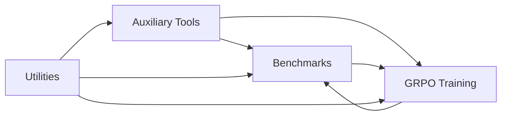
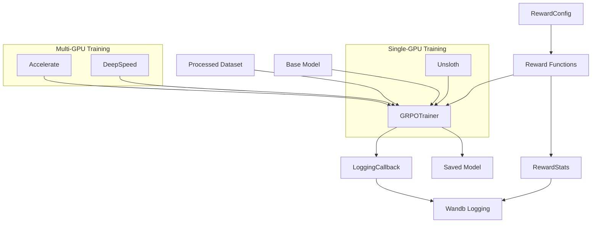
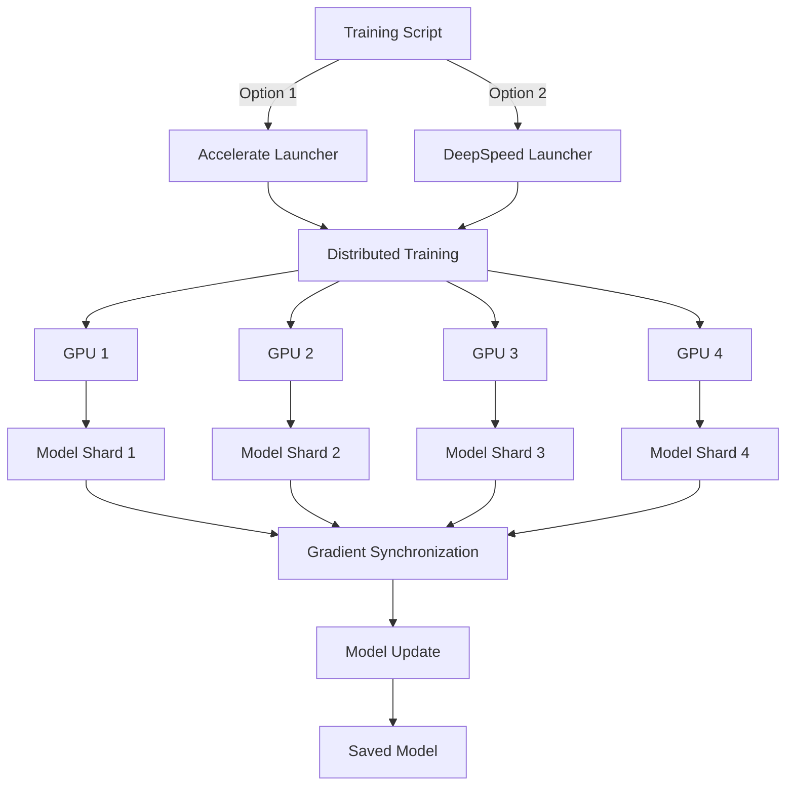

# System Patterns: Mathematical Problem-Solving Framework

**System Architecture:**

The framework follows a modular architecture with three main components: Benchmarks, GRPO Training, and Utilities/Auxiliary Tools. These components interact to create a continuous cycle of evaluation, improvement, and data management.

*   **Auxiliary Tools:** Primarily responsible for data processing and model management, providing clean and formatted datasets for both benchmarking and training.
*   **Benchmarks:** Evaluate model performance on various mathematical tasks and generate results that inform training and analysis. This component includes a diverse set of benchmarks such as Standard, Filtered Standard, Programming, Filtered Programming, Test, Programmer-Test, Architect (One-to-One Engineer-Programmer), Tutor, Step, Dual Proof, Reflective, and Reflective Majority benchmarks.
*   **GRPO Training:** Fine-tunes language models using reinforcement learning, utilizing reward functions based on benchmark criteria and processed datasets.
*   **Utilities:** Provide foundational functionalities used across all components, including agents, model interaction, data preparation, logging, progress tracking, similarity checking, and solution validation.

**Key Technical Decisions:**

*   **Language Model Interaction:** Use a consistent interface (`model_utils.py`) for interacting with both local and cloud-based language models, including robust error handling, retries, and timeouts.
*   **Secure Code Execution:** Implement secure sandboxed environments (`solution_utils.py`) for executing generated Python code in the Programming Benchmark and related benchmarks to prevent malicious code execution.
*   **Parameter-Efficient Fine-Tuning:** Utilize LoRA adapters and integration with Unsloth for efficient training of large language models, reducing memory requirements and training time.
*   **HuggingFace Ecosystem Integration:** Leverage the HuggingFace `datasets` library for dataset management, sharing, and versioning, and the HuggingFace Hub for model and dataset uploads/downloads.
*   **Wandb Integration:** Use Wandb for experiment tracking, visualization of training metrics, and detailed analysis of reward components.
*   **Structured Logging and Progress Tracking:** Implement comprehensive logging (`logger.py`) and progress tracking (`progress_tracker.py`) for detailed monitoring and analysis of benchmark runs and training processes.
*   **Answer Verification and Validation:** Employ robust methods for extracting and verifying mathematical answers, including numeric validation with tolerance and handling of LaTeX notation (`solution_utils.py`).
*   **Step-by-Step Analysis:** Implement functionality to break down solutions into individual steps and analyze them for correctness (`solution_benchmark.py`, `step_benchmark.py`).
*   **Reward-Based Training:** Implement a comprehensive reward system for GRPO training with specialized reward functions for different mathematical tasks, detailed statistics tracking, and integration with Wandb for visualization.
*   **Reflective Problem-Solving:** Implement reflective solver components that evaluate both solution correctness and self-assessment accuracy, tracking detailed reflection statistics including true/false positives/negatives.

**Design Patterns in Use:**

*   **Modular Design:** The framework is divided into distinct, interacting modules (Benchmarks, GRPO, Utilities, Auxiliary) to promote code organization, reusability, and maintainability.
*   **Agent-Based Design:** Utilize specialized agent classes (`agents.py`) for different mathematical tasks, each with optimized system prompts and consistent interfaces (e.g., `FullSolutionAgent`, `ProgrammingAgent`, `TestingAgent`, `ArchitectAgent`, `TutorAgent`, `FinalizationAgent`, `DualProofAgent`, `ReflectiveSolutionAgent`, `TestDrivenProgrammerAgent`).
*   **Configuration Objects:** Use dataclasses (`benchmark_config.py`, `grpo/config.py`) for managing configuration options, providing a structured and validated way to configure benchmarks and training.
*   **Utility Functions:** Employ a collection of utility functions (`solution_utils.py`, `data_preparation.py`, etc.) to encapsulate common functionalities and promote code reuse.
*   **Factory Pattern:** Use a factory function (`model_utils.py.get_model`) to create appropriate model interfaces based on configuration.
*   **Strategy Pattern:** Implement different reward strategies (`rewards.py`) that share a common interface but provide specialized behavior for different mathematical tasks.
*   **Observer Pattern:** Use callbacks (`LoggingCallback`) to monitor training progress and update statistics without modifying the core training loop.
*   **Template Method Pattern:** Define abstract base classes (`BaseReward`) that implement common behavior while allowing subclasses to override specific steps.

**Component Relationships:**

*   Benchmarks depend on Utilities for core functionalities like model interaction, solution validation, and progress tracking.
*   GRPO Training depends on Utilities for data preparation, similarity checking, solution validation, and model interaction.
*   Both Benchmarks and GRPO Training depend on Auxiliary Tools for processed datasets and exported models.
*   Auxiliary Tools utilize Utilities for tasks like solution validation and model interaction.
*   Reward functions in GRPO Training are designed to align with the evaluation criteria of specific benchmarks.

**GRPO Training Architecture:**

*   **Reward Functions:** Specialized reward functions for different mathematical tasks, each with a common interface but task-specific evaluation criteria.
*   **Reward Statistics:** Detailed tracking of reward components, distributions, and task-specific metrics for analysis and visualization.
*   **GRPO Trainer:** 
    * **Single-GPU Version:** Integrates with Unsloth for efficient training of Qwen models on a single GPU.
    * **Multi-GPU Version:** Uses TRL with Accelerate or DeepSpeed for distributed training across multiple GPUs.
*   **Logging Callback:** Monitors training progress, updates statistics, and logs metrics to Wandb for visualization.
*   **Model Saving:** Saves models in merged format for easy deployment, with support for quantization and adapter integration.

**Multi-GPU Training Architecture:**

*   **Training Script Options:**
    * **Accelerate Launcher:** Uses HuggingFace's Accelerate library for distributed training with simpler configuration but fewer optimization options.
    * **DeepSpeed Launcher:** Uses Microsoft's DeepSpeed library for distributed training with more advanced optimization options like ZeRO.
*   **Model Distribution:** Automatically distributes model weights across multiple GPUs using device_map="auto" for efficient memory usage.
*   **Gradient Synchronization:** Synchronizes gradients across all GPUs to ensure consistent model updates.
*   **ZeRO Optimization:** When using DeepSpeed, implements ZeRO stage 2 optimization with CPU offloading for memory efficiency.
*   **Mixed Precision:** Automatically uses BF16 or FP16 based on hardware support for faster training and reduced memory usage.
*   **Gradient Checkpointing:** Reduces memory usage by recomputing intermediate activations during the backward pass instead of storing them.
